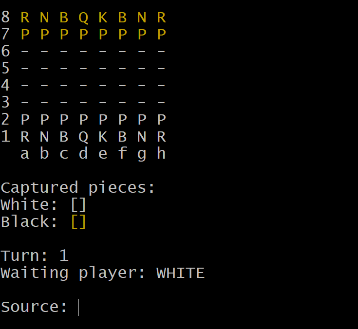

# java-chess-system
Projeto de um sistema de jogo de xadrez construído com Java durante o curso "Java 2023 Programação Orientada a Objetos" de [@acenelio](https://github.com/acenelio)

## Modo do uso
Rode o programa na pasta "application/Program"
- Para melhor aproveitamento utilize o programa em um terminal colorido que aceite "ANSI escape sequences".

